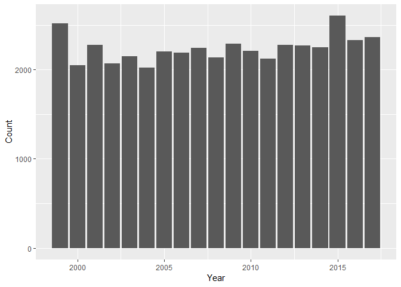

This document describes methods used in the paper **'Progress,
challenges and opportunities for plant Red Listing'**. Each numbered
section relates to numbered sections in the manuscript. See section
[04\_docs](https://github.com/stevenpbachman/RedList_Challenges/tree/master/02_docs)
for the manuscript.

### 1. Introduction

*Total number of taxa on the Red List:*

    #install.packages("rredlist")
    library(rredlist)

    # get the total number of taxa
    rl_count = rredlist::rl_sp_count(key = rlkey)
    rl_count = rl_count$count

    # note the version of the Red List
    rl_ver = rredlist::rl_version(key = rlkey)

**Number of taxa on the Red List = 95922**

**Red List version = 2018-1**

*Total number of species on the Red List:*

    # this function will get basic data from the Red List
    rl_all_IDs = function(rlkey){
      
      # get page with 10,000   
      i=1
      testcount = 1
      rl = rl_sp(0, key = rlkey)
      rl.all = rl$result
      
      # use 'while' to loop through pages until there are no more pages
      while ((testcount)>'0'){
        test = rl_sp(i, key = rlkey)
        testcount = test$count
        rl.all = rbind(rl.all,test$result)
        i = i+1
      }
    return(rl.all)  

    }

Run the rl\_all\_IDs function to get the full red list of taxa. Subset
to remove infra rank and populations to get all species

    # run rl_all_IDs to get dataframe of all taxa on Red List 
    all_taxa = rl_all_IDs(rlkey)

    # subset to remove subspecies and infra ranks
    all_RL_species = subset(all_taxa, is.na(all_taxa$infra_rank) & is.na(all_taxa$population))

    # Get total number of 'species' on Red List
    rl_row = nrow(all_RL_species)

**Number of species on the Red List = 93577**

### 1.1 Gaps in Red List coverage – why the missing species matter

*Percentage of described vertebrate species that have been Red Listed:*

Estimated number of described species of vertebrates, invertebrates,
plants and fungi. Source:
<http://cmsdocs.s3.amazonaws.com/summarystats/2018-1_Summary_Stats_Page_Documents/2018_1_RL_Stats_Table_1.pdf>

    # subset all species to get only vertebrates
    all.verts = subset(all_RL_species, all_RL_species$phylum_name == "CHORDATA")

    # estimated number of described species of VERTEBRATES
    described.verts = 69276

    # proportion vert species described that have been Red Listed
    prop.verts.RL = round((nrow(all.verts)/described.verts)*100, digits = 2)

**Proportion of vertebrate species described that have been Red Listed =
67.2%**

*Percentage of described invertebrates, plants and fungi species that
have been Red Listed:*

    # subset all species to get only plants
    all.plants = subset(all_RL_species, all_RL_species$kingdom_name == "PLANTAE") #KINGDOM = PLANTAE
    all.plants.count = nrow(all.plants)

    # print
    print(paste0('Number of plant species Red Listed = ',all.plants.count))

    ## [1] "Number of plant species Red Listed = 25452"

**Number of plant species Red Listed = 25452**

    # fungi and protists covered in two kingdoms so use 'which' and pipe symbol to combine
    all.fungi = all_RL_species[ which(all_RL_species$kingdom_name == "FUNGI" | all_RL_species$kingdom_name == "CHROMISTA"),]
    all.fungi.count = nrow(all.fungi)

**Number of fungi species Red Listed= 71**

    # inverts is any animalia that isn't phylum CHORDATA so use kingdom == ANIMALIA & phylum != CHORDATA
    all.inverts = all_RL_species[ which(all_RL_species$kingdom_name == "ANIMALIA" & all_RL_species$phylum_name != "CHORDATA"),]
    all.inverts.count = nrow(all.inverts)

**Number of invertebrate species Red Listed = 21498**

    all.RL.nonverts =  all.plants.count + all.fungi.count + all.inverts.count

**Number of != vertebrate species Red Listed = 47021**

Estimated number of described species of invertebrates, plants and
fungi. Source:
<http://cmsdocs.s3.amazonaws.com/summarystats/2018-1_Summary_Stats_Page_Documents/2018_1_RL_Stats_Table_1.pdf>

For vascular plants source:  
Lughadha, E.M., Govaerts, R., Belayaeva, I., Black, N., Lindon, H.,
Allkin, R., Magill, R.E., Nicholson, N., 2016. Counting counts: revised
estimates of numbers of accepted species of flowering plants, seed
plants, vascular plants and land plants with a review of other recent
estimates. Phytotaxa 272, 82–88.
<https://www.biotaxa.org/Phytotaxa/article/view/phytotaxa.272.1.5>

    described.vasc.plants.niclughadha2016 = 383671
    described.fungi = 52280
    described.inverts = 1305250
    described.nonvert = described.vasc.plants.niclughadha2016 + described.fungi + described.inverts

    # proportion described invertebrates, plants and fungi species that have been Red Listed
    prop.nonverts.RL = all.RL.nonverts/described.nonvert*100

**Proportion of invertebrates described that have been Red Listed =
2.7%**

### 1.2 Growing the Red List - vascular plants as a case study

filter on vascular plants only and compare with best estimate for total
number of vascular plants i.e. Nic Lughadha et al 2016

    vasc_plants = subset(all.plants, all.plants$phylum_name == "TRACHEOPHYTA") #PHYLUM = TRACHEOPHYTA (vascular plants)
    nrow(vasc_plants)/described.vasc.plants.niclughadha2016*100

    ## [1] 6.588718

**Proportion of vascular plants that have been Red Listed = 6.5887179**

### 2.3 Batch assessment upload with ‘SIS Connect’

Percentage of assessments published on the Red List via SIS Connect
Craig Hilton-Taylor, pers. comm (10th August 2018)

    sis_connect_pub = 509
    sis_connect_pre_pub = 915

**Assessments published via SIS Connect = 509** **Assessments in SIS
Connect pipeline = 915**

### 2.4 Inclusion of assessments in languages other than English

List of mega diverse countries derived from this source:
<http://www.biodiversitya-z.org/content/megadiverse-countries.pdf>

    # read in table of mega diverse countries
    mega_diverse_countries <- read.csv("01_data/mega_diverse countries.csv")

    # get the number of megadiverse countries that speak Spanish, Portuguese or French as main language
    country.count = nrow(subset(mega_diverse_countries, mega_diverse_countries$Span.Port.or.French == "Yes"))

**Number of mega diverse countries that Spanish, Portuguese or French =
7**

    # Red list assessments in other languages
    brazil_2016_prt = 20
    haiti_2018_1_frnch = 38

### 2.5 Spatial tools support Red List automation

Craig Hilton-Taylor, pers. comm (10th August 2018)

    spatial_tools_citations = 1939

**Number of publications citing spatial tools 1939**

### 2.6 Linking new species and Red List assessment publications

To get the average number of new taxa described every year, data were
downloaded from IPNI Beta site: <https://beta.ipni.org/>

A query was made for each year, with a filter on 'Specific' taxa
(species). A csv for each year from 1999 - 2017 inclusive was
downloaded. See
[01\_data](https://github.com/stevenpbachman/RedList_Challenges/tree/master/01_data)
for raw data.

    # read in raw files. Thanks to Hayward Godwin: https://www.r-bloggers.com/merge-all-files-in-a-directory-using-r-into-a-single-dataframe/

    # get list of files, note full.names = true to get full path
    file_list = list.files("01_data/IPNI_downloads_25_07_2018/", full.names = TRUE)

    #create first dataset
    IPNI_raw <- read.csv("01_data/IPNI_downloads_25_07_2018/citations_1999.txt")

    # make blank DF with structure
    IPNI_raw = IPNI_raw[0,]

    for (file in file_list){
           
    # if the merged dataset does exist, append to it
      if (exists("IPNI_raw")){
        temp_dataset <-read.csv(file)
        IPNI_raw = rbind(IPNI_raw, temp_dataset)
        rm(temp_dataset)
      }
    }

    head(IPNI_raw)

    ##                                   id full.name       name.author
    ## 1   urn:lsid:ipni.org:names:319375-2        NA            Durkee
    ## 2  urn:lsid:ipni.org:names:1009750-1        NA   (Nees) Govaerts
    ## 3  urn:lsid:ipni.org:names:1008155-1        NA   (Nees) Vollesen
    ## 4  urn:lsid:ipni.org:names:1007456-1        NA Lejoly & Lisowski
    ## 5  urn:lsid:ipni.org:names:1014799-1        NA  (Leonard) Wassh.
    ## 6 urn:lsid:ipni.org:names:60466231-2        NA          H.P.Tsui
    ##                   scientific.name      family infrafamily            genus
    ## 1      Anisacanthus nicaraguensis Acanthaceae          NA     Anisacanthus
    ## 2       Chlamydacanthus rupestris Acanthaceae          NA  Chlamydacanthus
    ## 3        Cynarospermum asperrimum Acanthaceae          NA    Cynarospermum
    ## 4 Dischistocalyx champluvierianus Acanthaceae          NA   Dischistocalyx
    ## 5       Encephalosphaera puberula Acanthaceae          NA Encephalosphaera
    ## 6          Goldfussia grandissima Acanthaceae          NA       Goldfussia
    ##   infragenus          species infraspecies hybrid hybrid.genus  rank
    ## 1         NA    nicaraguensis           NA  false        false spec.
    ## 2         NA        rupestris           NA  false        false spec.
    ## 3         NA       asperrimum           NA  false        false spec.
    ## 4         NA champluvierianus           NA  false        false spec.
    ## 5         NA         puberula           NA  false        false spec.
    ## 6         NA      grandissima           NA  false        false spec.
    ##                                                                                     reference
    ## 1                                     Novon 9(4): 503 (-505, figs. 1, 6a). 1999 [30 Dec 1999]
    ## 2                                                    World Checkl. Seed Pl. 3(1): 14 (1999):.
    ## 3                                                     Kew Bull. 54(1): 172. 1999 [2 Jun 1999]
    ## 4                                             Bull. Jard. Bot. Natl. Belg. 67(1-4): 107. 1999
    ## 5 Monogr. Syst. Bot. Missouri Bot. Gard. 75: 953. 1999 [30 Jul 1999] ; Cat. Vasc. Pl. Ecuador
    ## 6                                                       Cat. Type Spec. China Suppl. 27. 1999
    ##   published publishing.author                           published.in.id
    ## 1      1999            Durkee    urn:lsid:ipni.org:publications:14256-2
    ## 2      1999          Govaerts    urn:lsid:ipni.org:publications:17755-2
    ## 3      1999          Vollesen      urn:lsid:ipni.org:publications:987-2
    ## 4      1999 Lejoly & Lisowski     urn:lsid:ipni.org:publications:1235-2
    ## 5      1999            Wassh.     urn:lsid:ipni.org:publications:1340-2
    ## 6      1999          H.P.Tsui urn:lsid:ipni.org:publications:20012011-1
    ##                               author.team.ids species.author.team.ids
    ## 1                        Durkee@18299-1@0@aut                    <NA>
    ## 2   Nees@6888-1@1@bas, Govaerts@36710-1@2@aut                    <NA>
    ## 3   Nees@6888-1@1@bas, Vollesen@11256-1@2@aut                    <NA>
    ## 4 Lejoly@22222-1@1@aut, Lisowski@5654-1@2@aut                    <NA>
    ## 5  Wassh.@11421-1@2@aut, Leonard@5480-1@1@bas                    <NA>
    ## 6                      H.P.Tsui@13819-1@1@aut                    <NA>
    ##   original.remarks bhl.page                           published.in
    ## 1               NA   641235                                  Novon
    ## 2               NA       NA                 World Checkl. Seed Pl.
    ## 3               NA       NA                              Kew Bull.
    ## 4               NA       NA           Bull. Jard. Bot. Natl. Belg.
    ## 5               NA       NA Monogr. Syst. Bot. Missouri Bot. Gard.
    ## 6               NA       NA           Cat. Type Spec. China Suppl.
    ##   bibliographic.reference bibliographic.type.info citation.type
    ## 1                    <NA>                    <NA>     tax. nov.
    ## 2                    <NA>                    <NA>    comb. nov.
    ## 3                    <NA>                    <NA>    comb. nov.
    ## 4                    <NA>                    <NA>     tax. nov.
    ## 5                    <NA>                    <NA>    comb. nov.
    ## 6                    <NA>                    <NA>     tax. nov.
    ##             reference.collation collection.number collector.team
    ## 1 9(4): 503 (-505, figs. 1, 6a)             25325     P.P.Moreno
    ## 2              3(1): 14 (1999):                                 
    ## 3                    54(1): 172                                 
    ## 4                  67(1-4): 107            M-1242       Lisowski
    ## 5                       75: 953                                 
    ## 6                            27             19329       T.T. Yü
    ##                                                                                                          distribution
    ## 1 Kukamonga, 18.5 m N of Esteli, 13°14'N, 86°21'W, ca. 850 m, Esteli (Nicaragua, Central America, Southern America)
    ## 2                                                                                                                    
    ## 3                                                                                                                    
    ## 4                                                                                                  Equatorial Guinea.
    ## 5                                                                                                                    
    ## 6                                                                                              China (Asia-Temperate)
    ##   end.page geographic.unit in.powo latitude.degrees latitude.minutes
    ## 1       NA              NA    true               NA               NA
    ## 2       NA              NA    true               NA               NA
    ## 3       NA              NA    true               NA               NA
    ## 4       NA              NA    true               NA               NA
    ## 5       NA              NA    true               NA               NA
    ## 6       NA              NA   false               NA               NA
    ##   latitude.seconds
    ## 1               NA
    ## 2               NA
    ## 3               NA
    ## 4               NA
    ## 5               NA
    ## 6               NA
    ##                                                              locality
    ## 1                                                                    
    ## 2                                                                    
    ## 3                                                                    
    ## 4 Estuaire du Rio Muni, village Mayang, au bord de la rivière Mitong
    ## 5                                                                    
    ## 6                                                   Yunnan: Gongshan,
    ##   longitude.degrees longitude.minutes longitude.seconds east.or.west
    ## 1                NA                NA                NA             
    ## 2                NA                NA                NA             
    ## 3                NA                NA                NA             
    ## 4                NA                NA                NA             
    ## 5                NA                NA                NA             
    ## 6                NA                NA                NA             
    ##   north.or.south name.status name.status.bot.code name.status.comment
    ## 1                                            <NA>                  NA
    ## 2                                            <NA>                  NA
    ## 3                                            <NA>                  NA
    ## 4                                            <NA>                  NA
    ## 5                                            <NA>                  NA
    ## 6                                            <NA>                  NA
    ##   name.status.type name.status.qualifier    original.basionym
    ## 1                                     NA                     
    ## 2                                     NA Aetheilema rupestre.
    ## 3                                     NA Blepharis asperrima.
    ## 4                                     NA                     
    ## 5                                     NA Aphelandra puberula.
    ## 6                                     NA                     
    ##   original.basionym.author.team original.cited.type
    ## 1                                                NA
    ## 2                        (Nees)                  NA
    ## 3                        (Nees)                  NA
    ## 4                                                NA
    ## 5                     (Leonard)                  NA
    ## 6                                                NA
    ##   original.hybrid.parentage
    ## 1                          
    ## 2                          
    ## 3                          
    ## 4                          
    ## 5                          
    ## 6                          
    ##   original.parent.citation.taxon.name.author.team
    ## 1                                              NA
    ## 2                                              NA
    ## 3                                              NA
    ## 4                                              NA
    ## 5                                              NA
    ## 6                                              NA
    ##   original.replaced.synonym original.replaced.synonym.author.team
    ## 1                                                              NA
    ## 2                                                              NA
    ## 3                                                              NA
    ## 4                                                              NA
    ## 5                                                              NA
    ## 6                                                              NA
    ##   original.taxon.distribution original.taxon.name
    ## 1                                              NA
    ## 2                                              NA
    ## 3                                              NA
    ## 4          Equatorial Guinea.                  NA
    ## 5                                              NA
    ## 6                                              NA
    ##   original.taxon.name.author.team other.links primary.pagination
    ## 1                              NA                             NA
    ## 2                              NA                             NA
    ## 3                              NA                             NA
    ## 4                              NA                             NA
    ## 5                              NA                             NA
    ## 6                              NA                             NA
    ##   publication.author publication.year.full publication.year.note
    ## 1                 NA    1999 [30 Dec 1999]         [30 Dec 1999]
    ## 2                 NA                  1999                  1999
    ## 3                 NA     1999 [2 Jun 1999]          [2 Jun 1999]
    ## 4                 NA                  1999                  1999
    ## 5                 NA    1999 [30 Jul 1999]         [30 Jul 1999]
    ## 6                 NA                  1999                      
    ##   publication.year.text        reference.remarks              remarks
    ## 1                    NA                          [Gandhi 15 Feb 2000]
    ## 2                    NA                                              
    ## 3                    NA                                              
    ## 4                    NA                                              
    ## 5                    NA ; Cat. Vasc. Pl. Ecuador                     
    ## 6                    NA                                              
    ##   secondary.pagination species.author standardised.basionym.author.flag
    ## 1                   NA             NA                                NA
    ## 2                   NA             NA                                NA
    ## 3                   NA             NA                                NA
    ## 4                   NA             NA                                NA
    ## 5                   NA             NA                                NA
    ## 6                   NA             NA                                NA
    ##   standardised.publication.flag standardised.publishing.author.flag
    ## 1                            NA                                  NA
    ## 2                            NA                                  NA
    ## 3                            NA                                  NA
    ## 4                            NA                                  NA
    ## 5                            NA                                  NA
    ## 6                            NA                                  NA
    ##   start.page suppressed top.copy
    ## 1         NA      false     true
    ## 2         NA      false     true
    ## 3         NA      false     true
    ## 4         NA      false     true
    ## 5         NA      false     true
    ## 6         NA      false     true
    ##                                                                                                                                                                                        type.locations
    ## 1                                                                                                                                                                             holotype MO;isotype CAS
    ## 2                                                                                                                                                                                                    
    ## 3                                                                                                                                                                                                    
    ## 4 holotype Herbarium, Université Libre de Bruxelles;isotype POZG;isotype Herbarium, Nationale Plantentuin van België;isotype Herbarium, Royal Botanic Gardens;isotype herb. du projet Curef à Bata
    ## 5                                                                                                                                                                                                    
    ## 6                                                                                                                                                                             holotype PE;isotype KUN
    ##   type.name type.remarks volume
    ## 1      <NA>                  NA
    ## 2      <NA>                  NA
    ## 3      <NA>                  NA
    ## 4      <NA>                  NA
    ## 5      <NA>                  NA
    ## 6      <NA>                  NA

    # save this down
    path = getwd()
    respath = paste0(path,"/04_outputs/IPNI_raw.csv")
    write.table(IPNI_raw, respath,row.names = FALSE, na="", sep = ",")

Sbuset the IPNI data to just tax.nov.

    tax.nov = subset(IPNI_raw, IPNI_raw$citation.type == "tax. nov.")

Summarise number of tax.nov by year

    library(tidyverse)

    ## -- Attaching packages ----------------------------------------------------------------------------------------- tidyverse 1.2.1 --

    ## v ggplot2 3.0.0     v purrr   0.2.4
    ## v tibble  1.4.2     v dplyr   0.7.5
    ## v tidyr   0.8.0     v stringr 1.3.0
    ## v readr   1.1.1     v forcats 0.3.0

    ## -- Conflicts -------------------------------------------------------------------------------------------- tidyverse_conflicts() --
    ## x dplyr::filter() masks stats::filter()
    ## x dplyr::lag()    masks stats::lag()

    tax.nov.year = tax.nov %>% dplyr::group_by(published) %>% dplyr::count(published)
    tax.nov.year

    ## # A tibble: 19 x 2
    ## # Groups:   published [19]
    ##    published     n
    ##        <int> <int>
    ##  1      1999  2522
    ##  2      2000  2049
    ##  3      2001  2275
    ##  4      2002  2073
    ##  5      2003  2151
    ##  6      2004  2024
    ##  7      2005  2201
    ##  8      2006  2189
    ##  9      2007  2243
    ## 10      2008  2139
    ## 11      2009  2290
    ## 12      2010  2212
    ## 13      2011  2123
    ## 14      2012  2281
    ## 15      2013  2268
    ## 16      2014  2248
    ## 17      2015  2605
    ## 18      2016  2333
    ## 19      2017  2368

Plot number of newly described taxa per year

    colnames(tax.nov.year)[which(names(tax.nov.year) == "published")] = "Year"
    colnames(tax.nov.year)[which(names(tax.nov.year) == "n")] = "Count"

    library(ggplot2)
    plot = ggplot(data = tax.nov.year) + 
      geom_col(aes(x = Year, y = Count))
    plot

    # get average number of described tax now between 1999 and 2017
    tax.nov.year.mean = mean(tax.nov.year$Count)

**The discovery of new plants occurs at a fairly consistent rate, with a
mean of 2241.7894737 per year (1999 – 2017)**

Kew Bulletin example - look at year range 2003 - 2017 (2003 onwards as
this is when 3.1 assessments first came in for plants). How many have
been red listed?

    # get Kew Bull species 2003 - 2017
    #create first dataset
    KewBull_raw <- read.csv("01_data/IPNI_Kew_Bulletin_IPNI_downloads_25_07_2018/citations_KewBull_2003-2017.txt")

    # summarise to just tax.nov
    KewBull_tax.nov = subset(KewBull_raw, KewBull_raw$citation.type == "tax. nov.")
    nrow(KewBull_tax.nov)

    ## [1] 1235

    # change column names to match
    colnames(KewBull_tax.nov)[which(names(KewBull_tax.nov) == "scientific.name")] = "scientific_name"

    # now link to the red list to see how many have been assessed
    KB_RL_joined = merge(KewBull_tax.nov, all.plants, by = "scientific_name" )

    # Get totals
    nrow(KB_RL_joined)

    ## [1] 116

    nrow(KB_RL_joined)/nrow(KewBull_tax.nov)*100

    ## [1] 9.392713

**Of the 1,234 newly described taxa published in Kew Bulletin from
2003–2017, only 1235 9.3927126 are currently on the Red List**

What is ratio of old (&gt;5 years) and new (&lt;=5 years) assessments
for each red list publicaiton year (Figure 2).

############### trying different method
